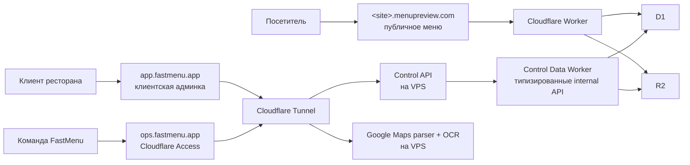

# FastMenu: базовая дорожная карта инфраструктуры

**Статус:** рабочий базис для реализации  
**Версия:** 1.0  
**Дата:** 2026-08-10

Этот документ фиксирует архитектуру первого SaaS-релиза FastMenu и порядок её реализации. Любая последующая задача по инфраструктуре, клиентской админке, публикации меню или публичным демо должна сверяться с ним. Изменения в базовых решениях оформляются отдельным решением в разделе «Открытые решения».

## 1. Цель первого релиза

FastMenu должен уметь:

1. Создать временный публичный preview ресторана на случайном поддомене `*.menupreview.com` без ручного создания DNS-записи.
2. Дать ресторану доступ к собственной админке, где он изменяет меню, цены, фото, часы работы и QR-ссылки.
3. Публиковать изменения как новую статическую версию сайта, не меняя публичный URL и с возможностью отката.
4. Отключать и затем удалять истёкшие preview автоматически.
5. Оставить Google Maps-парсер, OCR и рабочие инструменты закрытыми от публичного интернета.
6. Позволить команде FastMenu управлять проектами и запускать сбор данных в отдельной операторской зоне.

Первый контрольный клиент — текущий **Café Harmony**. Его данные являются источником для первой миграции и приёмочных тестов.

## 2. Зафиксированные архитектурные решения

| Решение | Выбор |
|---|---|
| Публичные сайты | Cloudflare Worker + D1 + R2 |
| Источник правды для маршрутизации | D1, а не `manifest.json` в R2 |
| Статусы preview | `preview`, `active`, `expired`, `deleted` |
| Версии сайта | Неизменяемые префиксы R2; активная версия задаётся в D1 |
| Удаление preview | Cron: сначала `expired`, после grace period — удаление R2-префикса |
| HTTP для R2-медиа | Полная обработка `ETag`, `304`, `Range`, `206`, `Content-Range` |
| Кеш | Workers Cache + корректные HTTP cache headers |
| Внешняя публикация артефакта | ZIP/загруженный артефакт или серверная сборка; никогда не удалённый `buildDirectory` |
| Публичные домены | `*.menupreview.com` |
| Кабинет ресторанов | `app.fastmenu.app` |
| Операторская зона | `ops.fastmenu.app`, Cloudflare Access + Tunnel |
| Парсер и OCR | Linux VPS; не Worker и не публичный origin |

## 3. Границы доменов и зон доверия



### 3.1 Публичное меню — `*.menupreview.com`

- Доступно всем без авторизации.
- Worker разрешает только публичные методы и файлы опубликованной версии.
- Не имеет маршрутов к админке, парсеру, OCR, черновикам или внутренним данным.
- Не использует cookie клиентской или операторской админки.
- Поддомены — только первого уровня: `cafe-harmony-<random>.menupreview.com`, не `cafe-harmony.preview.menupreview.com`.

### 3.2 Клиентская админка — `app.fastmenu.app`

- Единый кабинет всех ресторанов, а не админка на публичном hostname каждого демо.
- После входа пользователь видит только tenants, к которым имеет membership.
- Клиентская аутентификация реализуется приложением; Cloudflare Access клиентам не показывается.
- Cookie — host-only, с префиксом `__Host-`, `Secure`, `HttpOnly`, `SameSite=Lax` и CSRF-проверкой для изменяющих запросов.

### 3.3 Операторская зона — `ops.fastmenu.app`

- Только сотрудники FastMenu.
- Перед приложением всегда Cloudflare Access; допустимые личности задаются Access-политикой.
- Содержит поиск кафе, Google Maps-парсер, OCR, модерацию, поддержку, создание демо и служебные API.
- Никакой маршрут операторской зоны не должен быть доступен через `app.fastmenu.app` или `menupreview.com`.

### 3.4 VPS и Tunnel

- VPS не принимает публичный HTTP-трафик напрямую.
- `cloudflared` создаёт исходящее подключение к Cloudflare; tunnel маршрутизирует `app.fastmenu.app` и `ops.fastmenu.app` на внутренние сервисы.
- На firewall разрешаются только необходимые исходящие подключения: Cloudflare Tunnel, HTTPS к Google/сайтам/Nominatim и системные обновления.
- Парсер выполняется с ограниченной конкурентностью; для первого релиза — один активный job Google Maps на экземпляр.

## 4. Состав приложений после рефакторинга

Текущий проект — один Express-сервер `server.mjs`, который одновременно отдаёт публичные файлы, клиентскую админку, локальные JSON и запускает Chromium/OCR. Это необходимо разнести логически, но без рискованного «big bang» переписывания.

Целевая структура в репозитории:

```text
apps/
  edge-menu/             Cloudflare Worker: public delivery, events, Cron
  control-data/          Cloudflare Worker: D1/R2, publish и internal data API
  control-api/           клиентская и операторская API на VPS
  control-web/           клиентская и операторская веб-оболочка
packages/
  domain/                типы tenant/site/menu/version/role
  publisher/             статическая сборка и валидатор артефактов
  templates/             переносимые шаблоны лендингов
infra/
  cloudflare/            wrangler, D1 migrations, Worker tests
  docker/                Dockerfile, compose, cloudflared config
scripts/
  migrate-client-admin/  импорт текущего Café Harmony
```

Во время миграции существующий `server.mjs` остаётся рабочим. Функции переносятся по одной за стабильными API-контрактами. Локальные JSON не удаляются, пока импорт Café Harmony не прошёл проверку и откат.

### 4.1 Контракт доступа VPS к D1 и R2

VPS не получает возможность выполнять произвольный SQL через Cloudflare D1 REST API и не хранит широкий Cloudflare API token. D1 REST API предназначен главным образом для административных задач и имеет глобальные API rate limits.

Вместо этого `control-data` Worker получает D1/R2 bindings и предоставляет небольшой набор типизированных внутренних операций: `getTenantWorkspace`, `saveDraft`, `publishDraft`, `rollbackVersion`, `createPreview`, `finalizeArtifact`, `expireSites`.

- `control-api` на VPS вызывает эти методы только с отдельными service credentials, сохранёнными в secrets VPS.
- Internal Worker endpoint не принимает SQL, имена таблиц или произвольные R2 paths от вызывающего кода.
- Публичный `edge-menu` Worker имеет собственную ограниченную реализацию read-path и никогда не вызывает write-методы control API.
- Для обычной клиентской публикации publisher запускается внутри `control-data` Worker из уже сохранённого D1 draft; для внешнего ZIP используется отдельный ограниченный artifact workflow из раздела 7.2.

## 5. Модель данных D1

### 5.1 Обязательная таблица публичных сайтов

```sql
CREATE TABLE sites (
  hostname TEXT PRIMARY KEY,
  site_id TEXT NOT NULL UNIQUE,
  tenant_id TEXT NOT NULL,
  kind TEXT NOT NULL CHECK (kind IN ('preview', 'production')),
  status TEXT NOT NULL CHECK (status IN ('preview', 'active', 'expired', 'deleted')),
  active_version INTEGER,
  expires_at TEXT,
  grace_delete_at TEXT,
  created_at TEXT NOT NULL,
  updated_at TEXT NOT NULL
);

CREATE INDEX sites_cleanup_idx ON sites(status, grace_delete_at);
CREATE INDEX sites_tenant_idx ON sites(tenant_id);
```

`hostname`, `site_id`, `status`, `active_version` и `expires_at` обязательны для публичной маршрутизации. Worker читает запись до любого обращения к R2. `manifest.json` может быть полезен для аудита сборки, но не участвует в авторизации hostname.

### 5.2 Остальные сущности

| Таблица | Назначение |
|---|---|
| `tenants` | Ресторан/клиент: название, план, состояние |
| `users` | Учётные записи клиентов и сотрудников |
| `memberships` | Связь user ↔ tenant и роль `Owner`/`Manager`/`Viewer` |
| `menu_drafts` | Редактируемый JSON-документ меню, номер версии, автор и время изменения |
| `deployments` | Каждая версия сайта: номер, R2 prefix, хеш, статус загрузки, время публикации |
| `qr_codes` | QR-slug, tenant/site, активность и назначение |
| `analytics_events` | Ограниченное по сроку хранение событий публичного меню для существующего отчёта аналитики |
| `audit_log` | Кто и когда изменил меню, домен, статус, версию или QR |

### 5.3 Изоляция tenant-данных

Каждый запрос клиентской админки проходит одинаковый путь:

```text
session → user_id → membership(user_id, tenant_id) → role check → данные tenant_id
```

- `Owner` управляет пользователями, сайтом, доменом, QR и публикацией.
- `Manager` меняет контент и публикует, но не изменяет ownership.
- `Viewer` только просматривает меню и аналитику.
- `tenant_id` берётся из проверенной membership на сервере, а не из доверенного поля body или query string.
- Операторские права существуют отдельно от клиентских ролей.

## 6. R2: контракт статических артефактов

R2-bucket `menu-sites` остаётся приватным: его читает Worker и publisher, но не посетитель напрямую.

```text
staging/
  deployment_<uuid>/               временная проверяемая загрузка
sites/
  <site_id>/
    versions/
      1/
        index.html
        manifest.json
        assets/
          app.<content-hash>.js
          styles.<content-hash>.css
          dish.<content-hash>.webp
      2/
        ...
```

Правила:

1. После получения статуса `ready` файлы версии никогда не перезаписываются.
2. Успешно загрузить R2-файлы недостаточно: версия становится публичной только после переключения `sites.active_version` в D1.
3. `index.html` содержит данные опубликованного меню или ссылку только на версионный статический JSON. Он не делает запрос к текущему Express API `/api/public/menu`.
4. Названия assets содержат content hash. Для них допустим долгий immutable cache.
5. В `manifest.json` хранятся версия шаблона, список файлов, контрольные суммы, время сборки и источник данных. Он не является маршрутизатором или правом доступа.

## 7. Публикация и deployment API

### 7.1 Обычная публикация клиентом

```text
Клиент сохраняет draft
→ Control API проверяет tenant и роль
→ Publisher собирает ZIP из опубликованного snapshot
→ Validator проверяет ZIP
→ R2: staging
→ R2: sites/<siteId>/versions/<N>
→ D1 transaction: deployment=published, site.active_version=N
→ публичное меню начинает отдавать N
```

Публикация создаёт новую версию. Активная версия не редактируется напрямую.

### 7.2 Внешний артефакт от AI-агента

Внешний API не принимает путь к файловой системе. Разрешены только два безопасных способа:

1. API принимает ограниченный по размеру ZIP и сразу валидирует его.
2. API создаёт deployment и выдаёт краткоживущий scoped upload для единственного staging-префикса; после upload вызывается отдельный `finalize`.

Перед публикацией валидатор обязан проверить:

- наличие `index.html`;
- размер архива, число файлов и распакованный размер;
- отсутствие `..`, абсолютных путей, симлинков и повторов путей;
- допустимые MIME-типы и соответствие расширения содержимому;
- внутренние ссылки на assets;
- требуемые metadata: шаблон, site, версия, дата;
- отсутствие в ZIP секретов, `.env`, служебных файлов и server-side кода.

### 7.3 Атомарность и rollback

- `deployment` проходит состояния `uploading → ready → published` или `failed`.
- Только один publish может выполняться для одного `site_id` одновременно.
- Финальное переключение выполняется одной D1-транзакцией.
- Rollback — это создание нового audit event и переключение `active_version` на существующую проверенную версию.
- Ошибка в новой версии не затрагивает ранее опубликованный сайт.

## 8. Public Worker: обработка запросов

### 8.1 Request flow

1. Разобрать URL и нормализовать hostname.
2. Убедиться, что hostname является ровно одним поддоменом `menupreview.com`.
3. Разрешить только `GET` и `HEAD`; иные методы — `405`.
4. Прочитать запись `sites` из D1.
5. Для отсутствующего hostname — `404`; для `expired` — `410`; для `deleted` — `404`.
6. Получить `active_version` и построить R2 key безопасным способом.
7. Проверить Workers Cache.
8. При miss вызвать R2 `get` с conditional/range заголовками.
9. Вернуть корректный HTTP-ответ, затем сохранить разрешённый результат в Workers Cache.

### 8.2 HTTP-контракт

| Сценарий | Ответ |
|---|---|
| Неизвестный hostname | `404 Not Found` |
| Expired preview | `410 Gone` без данных меню |
| Объект отсутствует | `404 Not Found` |
| Обычный файл | `200 OK` + `ETag`, `Content-Type`, `Cache-Control` |
| Совпавший `If-None-Match` | `304 Not Modified` без body |
| Корректный `Range` | `206 Partial Content` + `Content-Range`, `Content-Length`, `Accept-Ranges: bytes` |
| Некорректный Range | `416 Range Not Satisfiable` + `Content-Range: bytes */<size>` |
| `HEAD` | Те же headers, body отсутствует |

`object.writeHttpMetadata()` переносит R2 metadata, но Worker самостоятельно выставляет статус 206 и range-заголовки; ответ с range никогда не должен маскироваться статусом 200.

### 8.3 Cache policy

- Версионные hashed assets: `public, max-age=31536000, immutable`.
- `index.html`: короткий TTL, чтобы новая версия становилась видимой быстро; стандарт первого релиза — 60 секунд.
- Ключ кеша содержит полный публичный URL, поэтому данные разных hostname не смешиваются.
- При publish не полагаться на кеш как на источник правды: Worker всегда получает версию из D1 при cache miss.
- Cache hit должен уменьшать обращения в R2; это проверяется метриками Cloudflare и тестом повторного запроса.

## 9. Срок жизни preview и Cron cleanup

### 9.1 Стандартные значения

| Параметр | Значение первого релиза |
|---|---|
| Срок preview | 30 дней |
| Grace period после expiry | 30 дней |
| Частота Cron | каждый час, UTC |
| Поведение `expired` | `410 Gone`, static menu не выдаётся |
| Поведение `deleted` | `404 Not Found` |

### 9.2 Порядок cleanup

1. Cron выбирает сайты `preview`, у которых `expires_at <= now`.
2. В транзакции D1 меняет их статус на `expired`, задаёт `grace_delete_at` и пишет audit event.
3. По истечении grace period Cron выбирает `expired` сайты.
4. Удаляет файлы `sites/<site_id>/` из R2 пакетами с безопасным продолжением после частичного сбоя.
5. Только после успешного удаления меняет статус на `deleted`.
6. Повторный запуск должен быть идемпотентным.

## 10. Клиентская админка

### 10.1 Минимальный функционал первого релиза

- вход, выход и сессия;
- просмотр и редактирование draft меню;
- категории, блюда, цены, описание, доступность, фото;
- часы работы, контакты, языки, QR;
- preview опубликованного меню;
- publish и rollback собственных версий;
- просмотр ограниченной аналитики;
- роли Owner/Manager/Viewer.

### 10.2 Аутентификация и сессии

- Пароли никогда не хранятся в `.env` или в открытом виде; в D1 хранится сильный password hash.
- В production обязательны отдельные session secret и CSRF protection.
- Любая авторизационная cookie имеет host-only область `app.fastmenu.app`; у публичных preview нет доступа к ней.
- Login rate limit и session expiry реализуются на сервере.
- Существующие `ADMIN_PASSWORD`, `ADMIN_SESSION_SECRET` и один фиксированный e-mail — временный локальный механизм, который не переносится как SaaS-авторизация.

### 10.3 Публичная аналитика

Текущий шаблон отправляет события на `/api/events`. В новом контуре он отправляет их только в edge endpoint Worker, например `/e` на публичном hostname. Endpoint проверяет схему события, tenant/site, ограничивает частоту и сохраняет данные с ограниченным сроком хранения. Клиентская админка читает только агрегаты своего tenant.

## 11. Операторская зона и Google Maps-парсер

- `ops.fastmenu.app` закрыт Cloudflare Access, но сам Control API продолжает проверять операторскую роль.
- Playwright запускается только на VPS, где доступны Chromium, системные зависимости, постоянный browser profile и OCR-пакеты.
- Сценарии Google Maps остаются последовательными и прекращаются при CAPTCHA/ограничениях, как делает текущий код.
- Сбор данных и разбор production assets не должны задерживать выдачу публичного меню: public Worker полностью независим от VPS.
- Оператор может превратить подготовленный проект в preview, но активирует его через тот же publisher и D1-контракт.

## 12. Инфраструктура как код

### 12.1 Cloudflare

- Worker управляется через `wrangler.toml`/`wrangler.jsonc` и TypeScript, не ручным редактированием прод-кода в dashboard.
- D1 schema создаётся только SQL migrations в репозитории.
- R2 binding, D1 binding, secrets, Worker routes и Cron описаны по окружениям `dev`, `staging`, `production`.
- `menupreview.com` получает proxied wildcard DNS и Worker route для поддоменов первого уровня.
- `app.fastmenu.app` и `ops.fastmenu.app` маршрутизируются через разные Tunnel hostname rules.

### 12.2 VPS

Docker Compose включает отдельные сервисы:

```text
control-api
control-web
parser-worker
cloudflared
```

Для первого релиза `parser-worker` может быть тем же образом кода, что и `control-api`, но запускается как отдельный процесс с одним job. Это сохраняет возможность вынести его в очередь/отдельный VPS позднее без изменения публичной архитектуры.

Обязательные production secrets задаются только в секретном окружении VPS/Cloudflare:

```text
CONTROL_SESSION_SECRET
DEPLOYMENT_SIGNING_SECRET
CLOUDFLARE_* bindings/secrets
```

Ни `.env`, ни секреты не коммитятся в репозиторий. Текущий `npm start` сам по себе `.env` не загружает, поэтому production deployment явно передаёт environment process/container.

### 12.3 DNS и Cloudflare routes

После покупки доменов конфигурация production имеет следующий минимальный набор:

| Hostname/route | Назначение | Куда направляется |
|---|---|---|
| `*.menupreview.com/*` | Все публичные сайты | `edge-menu` Worker |
| `app.fastmenu.app` | Клиентский кабинет | Tunnel → `control-web`/`control-api` |
| `ops.fastmenu.app` | Операторская зона | Cloudflare Access → Tunnel → operator routes |
| `internal.fastmenu.app` | Нет UI; ограниченный data gateway | `control-data` Worker, только service credentials |

- Для wildcard public domain создаётся proxied DNS record. Worker является origin и не должен обращаться к placeholder IP.
- Root domains не получают случайную tenant-маршрутизацию: для них создаётся явный ответ/redirect либо они остаются без приложения.
- Route `*.menupreview.com/*` не должен захватывать `app.fastmenu.app` и `ops.fastmenu.app`, потому что это другой базовый домен.
- Используются только TLS-имена первого уровня, которые покрывает Universal SSL: `slug.menupreview.com`, `app.fastmenu.app`, `ops.fastmenu.app`.
- `workers.dev` URL отключается после smoke test, чтобы публичный вход был только через ожидаемые домены.

### 12.4 Наблюдаемость и эксплуатация

Минимальный operational baseline первого релиза:

- структурированные логи Worker с `requestId`, hostname, siteId, version, cache result и HTTP status;
- alert на рост 5xx Worker, ошибки D1/R2, неуспешный Cron cleanup и недоступность Tunnel;
- internal `GET /health` у VPS control-api и parser-worker;
- журнал publish/rollback с deployment ID, actor, прежней и новой версией;
- runbook: как остановить parser, как откатить сайт, как отключить tenant, как восстановить Tunnel.

## 13. План миграции Café Harmony

1. Сохранить неизменяемую копию текущих `data/client-admin.json`, `data/client-analytics.json` и загруженных файлов как migration fixture.
2. Написать dry-run importer без внешних записей.
3. Импортировать tenant, первого Owner, draft, published snapshot, историю versions, QR и audit log в staging D1.
4. Сравнить количество меню, категорий, блюд, языков, часов, версий и QR с исходным JSON.
5. Сгенерировать preview на staging hostname и провести visual/API проверку.
6. После приёмки повторить импорт в production и опубликовать первый production/preview hostname.
7. Сохранить старый JSON в режиме read-only до завершения периода стабилизации.

## 14. Этапы реализации и критерии готовности

### Фаза A — фундамент Cloudflare

**Работа:** создать Worker scaffold, D1 migrations, R2 binding, окружения, локальные тесты Wrangler.

**Готово, когда:**

- миграции применяются к локальному и staging D1;
- Worker локально отдаёт fixture из R2 только для известного site record;
- неизвестный hostname не приводит к чтению R2;
- все конфигурации воспроизводимы из репозитория.

### Фаза B — корректная публичная отдача

**Работа:** реализация host lookup, safe key builder, ETag, conditional GET, Range, Workers Cache и HTTP tests.

**Готово, когда:**

- тесты покрывают `200`, `304`, `206`, `416`, `404`, `410`, `HEAD`;
- `curl -H 'Range: bytes=0-99'` возвращает корректный partial response;
- два разных hostname не могут получить файлы друг друга;
- response headers соответствуют cache policy.

### Фаза C — артефакты, publisher и версии

**Работа:** статический exporter текущего Classic Light, ZIP validator, R2 staging, D1 publish transaction и rollback.

**Готово, когда:**

- publisher создаёт независимый сайт без запросов к текущему Express public API;
- невалидный ZIP не меняет `active_version`;
- publish v2 сохраняет v1 и stable URL начинает показывать v2;
- rollback v1 работает без повторной сборки.

### Фаза D — lifecycle preview

**Работа:** Cron handler, expiry, grace cleanup, идемпотентное удаление R2.

**Готово, когда:**

- имитированный `expires_at` переводит сайт в `expired`;
- публичный URL возвращает `410`;
- cleanup удаляет только prefix нужного `site_id`;
- повтор cleanup не создаёт ошибку и не затрагивает другой сайт.

### Фаза E — мультиарендная клиентская админка

**Работа:** users/tenants/memberships, новые client API, roles, сессии, перенос текущего интерфейса.

**Готово, когда:**

- Owner Café Harmony может изменить draft и опубликовать его;
- Viewer получает `403` при изменении;
- пользователь одного tenant не может прочитать или изменить другой tenant даже при подмене ID в URL;
- публичное меню показывает только published snapshot.

### Фаза F — VPS, Tunnel и операторская зона

**Работа:** Dockerfile/Compose, Linux-зависимости Chromium/OCR, cloudflared, Cloudflare Access policy, production environment.

**Готово, когда:**

- `app.fastmenu.app` доступен клиенту через Tunnel;
- `ops.fastmenu.app` требует Access login;
- origin не принимает публичный входящий HTTP;
- Playwright и OCR проходят smoke test на VPS.

### Фаза G — миграция, приёмка и запуск

**Работа:** Café Harmony importer, end-to-end проверка, мониторинг ошибок, документация запуска и отката.

**Готово, когда:**

- Café Harmony корректно отображается в клиентской админке и на public preview;
- весь пользовательский сценарий проходит от редактирования цены до публикации;
- пробный expiry и rollback подтверждены;
- владелец проекта получил runbook с понятными действиями на случай сбоя.

## 15. Приёмочный сценарий первого релиза

1. Оператор создаёт tenant и preview Café Harmony.
2. Worker получает hostname из D1 и отдаёт v1 из R2.
3. Клиент Café Harmony входит на `app.fastmenu.app`.
4. Клиент меняет цену, сохраняет draft и публикует v2.
5. Тот же публичный URL начинает показывать v2; v1 доступна для rollback только внутренне.
6. `If-None-Match` получает 304, `Range` для видео/медиа — 206.
7. QR ведёт на стабильный публичный hostname.
8. После искусственного expiry public URL возвращает 410, а клиент больше не получает меню.
9. Операторский доступ без Cloudflare Access невозможен.
10. Парсер Google Maps не доступен из публичного Worker route.

## 16. Календарный план

| Фаза | Трудоёмкость | Зависимость |
|---|---:|---|
| A. Cloudflare foundation | 1–2 рабочих дня | Cloudflare account |
| B. Public Worker и HTTP | 2–3 дня | A |
| C. Publisher и версии | 3–4 дня | A, B |
| D. Expiry/Cron | 1 день | A, B |
| E. Клиентская админка и tenant isolation | 4–6 дней | A, C |
| F. VPS/Tunnel/Access | 2–3 дня | VPS + Cloudflare account |
| G. Миграция и запуск | 2–3 дня | все предыдущие |
| **Итого** | **14–20 рабочих дней** | обычно 3–4 календарные недели |

Фазы B, C и часть F выполняются параллельно после готовности базовых аккаунтов. Календарное время растёт только из-за регистрации, оплаты, DNS/SSL propagation и ваших финальных подтверждений.

## 17. Участие владельца проекта

Владелец выполняет только необратимые и юридически привязанные действия:

1. Регистрирует Cloudflare и VPS-аккаунты на свои данные, включает MFA.
2. Утверждает реальные имена и покупку `menupreview.com`/`fastmenu.app` или их замен.
3. Подтверждает оплату Workers Paid и VPS.
4. Подтверждает e-mail(ы), которым разрешён операторский Cloudflare Access.
5. Подтверждает финальный production launch.

Разработчик выполняет код, миграции, конфигурации, локальную и staging-проверку, развёртывание через интерактивную авторизацию, документацию и тесты. Пароли, платёжные данные и долгоживущие API-токены не передаются через чат.

## 18. Бюджет первого релиза

| Статья | Оценка |
|---|---:|
| Два домена | ориентир $20–35/год; цена подтверждается перед покупкой |
| Cloudflare DNS + Universal SSL | $0 |
| Workers Paid | $5/месяц |
| R2 | $0 в пределах стартовых 10 GB и 10 млн чтений/месяц |
| D1 | без отдельной стоимости на пилотной нагрузке |
| Cloudflare Access + Tunnel | $0 для команды до 50 пользователей |
| VPS 4 vCPU / 8 GB | ориентир €10–25/месяц |
| **Регулярная база** | **$5 + €10–25/месяц** |

Workers Paid включает 10 млн запросов и 30 млн CPU-миллисекунд в месяц. R2 Standard включает 10 GB хранения, 1 млн операций записи и 10 млн операций чтения. Точный счёт зависит от трафика, количества версий и объёма медиа.

## 19. Вне границ первого релиза

Следующие возможности не блокируют запуск и не входят в первоначальную реализацию:

- подключение собственных доменов ресторанов;
- биллинг и подписки;
- автоматические платёжные статусы и приостановка при неоплате;
- отдельный job queue/несколько parser workers;
- многорегиональная control plane;
- marketplace шаблонов.

Архитектура не должна мешать их добавлению: публичный hostname уже отделён от `site_id`, а версии и tenant-данные не завязаны на один домен.

## 20. Открытые решения до начала provisioning

| Решение | Предлагаемый default | Кто подтверждает |
|---|---|---|
| Реальные имена доменов | `menupreview.com`, `fastmenu.app` | Владелец |
| VPS-провайдер и локация | EU, 4 vCPU / 8 GB / 80–160 GB | Владелец |
| Срок preview / grace | 30 / 30 дней | Владелец |
| Разрешённые e-mail операторов | список сотрудников FastMenu | Владелец |
| Первое публичное имя Café Harmony | случайный preview slug | Владелец после теста |

После подтверждения этих пяти пунктов стартуем с фаз A: создаём edge-модуль, D1 migrations и тестовый public Worker в staging.

## 21. Технические источники для реализации

- [Cloudflare Workers: Routes](https://developers.cloudflare.com/workers/configuration/routing/routes/)
- [Cloudflare Universal SSL: ограничения покрытия hostname](https://developers.cloudflare.com/ssl/edge-certificates/universal-ssl/limitations/)
- [Cloudflare R2 Workers API](https://developers.cloudflare.com/r2/api/workers/workers-api-reference/)
- [Cloudflare Workers Cache](https://developers.cloudflare.com/cache/interaction-cloudflare-products/workers/)
- [Cloudflare D1: безопасный proxy Worker для внешних приложений](https://developers.cloudflare.com/d1/tutorials/build-an-api-to-access-d1/)
- [Cloudflare Tunnel: outbound-only connection](https://developers.cloudflare.com/cloudflare-one/networks/connectors/cloudflare-tunnel/)
- [Cloudflare Cron Triggers](https://developers.cloudflare.com/workers/configuration/cron-triggers/)
- [Cloudflare Workers pricing](https://developers.cloudflare.com/workers/platform/pricing/)
- [Cloudflare R2 pricing](https://developers.cloudflare.com/r2/pricing/)
