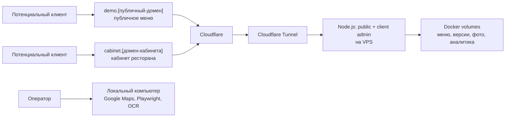

# FastMenu: быстрый пилот для проверки спроса

**Статус:** рабочий план запуска до перехода к полной SaaS-инфраструктуре  
**Дата:** 2026-08-10  
**Основа:** `D:\proekty\landos\infrastructure-roadmap.md`

## Решение

Не строим сейчас Worker + D1 + R2, многопользовательскую модель, биллинг и автоматическое истечение preview. Для проверки спроса поднимаем существующий рабочий Café Harmony как один живой demo-workspace:

`cloudflared` создаёт исходящее соединение к Cloudflare, поэтому приложению на VPS не нужен открытый HTTP-порт. Это соответствует принципу Cloudflare Tunnel: origin не получает публично маршрутизируемый IP-трафик напрямую. [Документация Cloudflare Tunnel](https://developers.cloudflare.com/cloudflare-one/networks/connectors/cloudflare-tunnel/)

## Что уже есть в проекте

- Рабочее публичное меню Classic Light, публикация версий и откат.
- Кабинет ресторана: меню, цены, доступность, фото, часы, контакты, QR и простая аналитика.
- Данные и первый демонстрационный tenant **Café Harmony** в `data/client-admin.json`.
- Персональные price-кабинеты опубликованных демо в `data/published-sites/site-admin/`: учётная запись изолирована по `siteId`, а публикация создаёт новую статическую версию лендинга.
- Локальный Google Maps-парсер, OCR, выгрузки и Chrome-профиль.

Последний пункт **не разворачивается на VPS в пилоте**. При 2 GB RAM его браузерные процессы будут конкурировать с кабинетом и создадут ненужный риск. VPS обслуживает только опубликованное меню и кабинет.

## Граница пилота

### Входит

| Возможность | Как работает в пилоте |
|---|---|
| Ссылка для показа услуги | `https://demo.[домен]/` ведёт сразу на опубликованное меню |
| Кабинет | `https://cabinet.[домен]/` ведёт на `/admin.html` |
| Изменение цен и публикация | `cabinet.menu-on.com/sites/<slug>`: личный кабинет конкретного кафе; данные и версии живут в Docker volume на VPS |
| Фото | Загружаются в постоянный Docker volume |
| QR | Генерируется в кабинете, но ведёт на публичный hostname |
| Аналитика меню | События публичного меню хранятся локально на VPS |
| Изоляция | Публичный hostname не видит кабинет, экспорт, Google Maps-парсер или служебные API |
| Обновление приложения | Пересборка Docker-образа; данные меню и фото не перезаписываются |

### Сознательно не входит

- Несколько ресторанов, параллельно редактируемых в одной установке.
- Саморегистрация, восстановление пароля, платежи, роли нескольких клиентов.
- D1, R2, Workers Cache, Cron, versioned artifact storage.
- Автоматическая очистка истёкших демонстраций.
- Cloudflare Access для кабинета клиента: клиент входит собственной учётной записью приложения; Access останется для будущей операторской зоны.

Следствие: общий кабинет Café Harmony остаётся визуальным демо полного продукта, но у каждого опубликованного лендинга теперь есть изолированный price-кабинет. Он годится для коммерческого предложения: клиент может изменить цену и увидеть обновление на своём hostname. Полное многопользовательское редактирование позиций, фотографий, часов, контактов и аналитики остаётся задачей следующего этапа.

## Домены: две допустимые конфигурации

### Рекомендуемая

- публичное меню: `demo.menu-on.com` или `cafe-harmony.menu-on.com`;
- кабинет: `cabinet.[отдельный-домен]`.

Это сохраняет полное разделение базовых доменов из основной дорожной карты. Это правильный вариант, если сразу выдаём реальный доступ нескольким клиентам.

### Самая дешёвая на период проверки

- публичное меню: `demo.menu-on.com`;
- кабинет: `cabinet.menu-on.com`.

Один оплаченный домен, но два разных hostname. Cookie кабинета в приложении host-only, а сервер дополнительно разрешает на каждом hostname только свой список маршрутов. Это достаточно для короткого контролируемого теста, **но это временное послабление** относительно целевой схемы с разными базовыми доменами. При подтверждённом спросе кабинет переносится на отдельный домен до запуска многопользовательского режима.

На первом развёртывании создаются точные hostname `demo` и `cabinet`. После
готовности защищённого endpoint публикации добавляется один wildcard DNS/Tunnel
route `*.menu-on.com`; он обслуживает только активные записи в реестре и не
превращает неизвестные поддомены в публичные сайты.

## Технические гарантии пилота

При `PILOT_MODE=1` код сервера до раздачи статики проверяет hostname и путь.

| Хост | Разрешено |
|---|---|
| Публичный | `/menu`, `/from/*`, `/r/*`, `/api/public/menu`, `POST /api/events`, Classic Light, опубликованные изображения |
| Кабинет | `/admin.html`, его CSS/JS, `/api/admin/*`, генерация QR, загруженные изображения |
| Оба | только технический `/healthz` |
| Любой прочий путь | `404` |

Поэтому `/api/export`, Google Maps-маршруты, массивы кандидатов, OCR и основной операторский интерфейс не попадают наружу. В пилотном режиме отключено стартовое обслуживание данных парсера, чтобы VPS не читала и не переписывала его рабочие файлы.

Node-контейнер не публикует порт на VPS. Его видит только контейнер `cloudflared` во внутренней Docker-сети. У VPS остаётся только SSH для администратора; перед закрытием входящих портов нужно отдельно подтвердить, что SSH-вход по ключу работает.

## Метрики и решение о дальнейшем вложении

Не считаем простые просмотры доказательством спроса. Главный показатель — реакция ресторана на конкретное предложение.

| Роль | Метрика | Формула / источник | Зачем нужна |
|---|---|---|---|
| Главная | Квалифицированная реакция | Рестораны, которые ответили и согласились на разговор, попросили демо-доступ или дали данные меню / число персонально получивших ссылку | Ближайший сигнал реальной проблемы и готовности обсуждать решение |
| Диагностика | Переход к действию | Число встреч + запросов личного доступа + первых публикаций меню | Показывает, не остался ли интерес вежливым ответом |
| Диагностика | Использование меню | Уникальные посетители и действия меню из кабинета | Проверяет, открывают ли присланную ссылку; не является метрикой продаж |
| Ограничитель | Надёжность демонстрации | Ошибки запуска, недоступные ссылки, время ручного сопровождения | Не дать «успешным» просмотрам скрыть плохой опыт |

**Период:** три недели с первой персональной рассылки.  
**Минимальная выборка:** 25 целевых заведений; каждое получает отдельное, осмысленное сообщение, а не массовую рассылку.  
**Рабочий критерий перехода к полной архитектуре:** не менее 5 квалифицированных реакций, не менее 2 запросов на собственный доступ/пилот и как минимум один разговор о платном продолжении или согласованный ценовой диапазон.

Это стартовые пороги, а не рыночные бенчмарки: у проекта нет истории продаж. Если за период будет 2–4 сильные реакции, проводим интервью и меняем предложение; если 0–1 — сначала пересматриваем сегмент, ценность или канал, а не строим SaaS.

### Где фиксировать результаты

Один небольшой реестр лидов (имя заведения, дата отправки, ссылка, ответ, встреча, запрос доступа, комментарий о цене) является источником правды по спросу. Встроенная аналитика меню — только дополнительная диагностика. Это защищает от ложного вывода «было много просмотров, значит готовы платить».

## Стоимость и срок

| Статья | Пилот |
|---|---|
| VPS | уже есть, дополнительных затрат нет |
| Домен | один для самого дешёвого варианта; два для строгого разделения |
| Cloudflare Tunnel и DNS | можно начать на Free-плане |
| Workers Paid | в этом пилоте не нужен; $5/месяц понадобится при переходе к Worker-архитектуре по основной дорожной карте |
| D1/R2 | в этом пилоте не используются |

По официальной документации у Cloudflare есть Workers Free-план, а пример Standard-плана начинается с $5 в месяц. Для описанного Tunnel-пилота Worker вообще не запускается. [Workers pricing](https://developers.cloudflare.com/workers/platform/pricing/)

После получения домена, доступа по SSH и создания Tunnel запуск занимает **один рабочий день**: настройка VPS, доменов, секретов, деплой и внешняя приёмка. DNS и выпуск сертификата иногда добавляют ожидание от минут до 24 часов. Подготовка к этому запуску уже внесена в проект.

## Что делает владелец, а что выполняется в проекте

| Действие владельца | Почему нельзя делегировать |
|---|---|
| Купить домен(ы), оплатить VPS/Cloudflare при необходимости | Деньги, договор и право владения |
| Подтвердить Cloudflare-аккаунт, MFA и смену NS | Доступ к вашему домену и аккаунту |
| Предоставить безопасный SSH-доступ к VPS или выполнить команды в своей сессии | Секреты и контроль сервера |
| Создать Tunnel в Cloudflare Dashboard и сохранить token прямо на VPS | Token даёт доступ к origin и не передаётся в чат |
| Утвердить публичный и кабинетный hostname | Это решение бренда и стоимости доменов |

Остальное — Docker-конфигурация, защита маршрутов, переменные окружения, проверка, тестовые URL, запуск и runbook — подготовлено в репозитории и выполняется мной после этих точек доступа.

## Переход к полной версии

Не переносим пилот «как есть» в production. Когда метрика пройдена:

1. Создаём D1 как источник правды `hostname → siteId/status/activeVersion/expiresAt`.
2. Переносим публичные версии в R2 и ставим Worker перед `*.public-domain`.
3. Добавляем корректные 304/206/Range, Workers Cache и Cron-очистку.
4. Выносим кабинет на отдельный базовый домен, вводим tenants, users и нормальную модель публикации.
5. Операторскую зону, парсер и OCR закрываем Cloudflare Access + Tunnel.

Полные требования и последовательность уже зафиксированы в основной дорожной карте; этот документ не меняет их, а сокращает первый шаг до проверяемого рыночного эксперимента.

## Персональные демо-лендинги в пилоте

Для каждого кафе оператор запускает разбор локально и в разделе «Прод» указывает
поддомен, например `cafe-roma.menu-on.com`. Локальный сервер собирает готовый
один HTML-артефакт, считает SHA-256 и передаёт его на VPS по отдельному
токенизированному endpoint. Путь к локальной папке или произвольная команда на
VPS по сети не передаются.

VPS сохраняет артефакт в `data/published-sites/<siteId>/versions/<version>/`
и только после этого обновляет реестр `data/published-sites/sites.json`:
`hostname`, `siteId`, `status`, `activeVersion`, `expiresAt`. Реестр является
источником правды для пилота; сам HTML не может стать доступным без записи в
реестре. Обновление того же кафе создаёт новую версию и переключает
`activeVersion`.

В Cloudflare добавляется один wildcard Public Hostname `*.menu-on.com` на тот
же Tunnel. Сервер всё равно отдаёт только зарегистрированные hostname и только
корень лендинга; `cabinet.menu-on.com` и `demo.menu-on.com` остаются точными,
изолированными маршрутами. Для опубликованного кафе личная ссылка имеет вид
`cabinet.menu-on.com/sites/<slug>`; она требует отдельные credentials и может
управлять только ценами этого hostname. Это ещё не заменяет полноценную
многопользовательскую модель кабинетов из целевой архитектуры.
